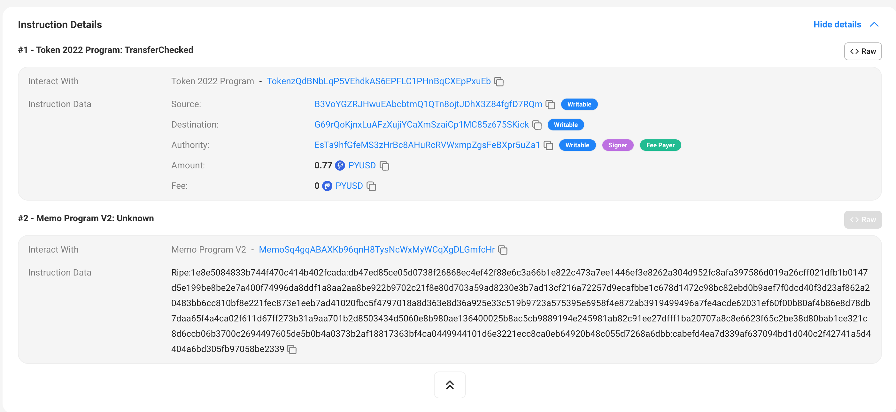
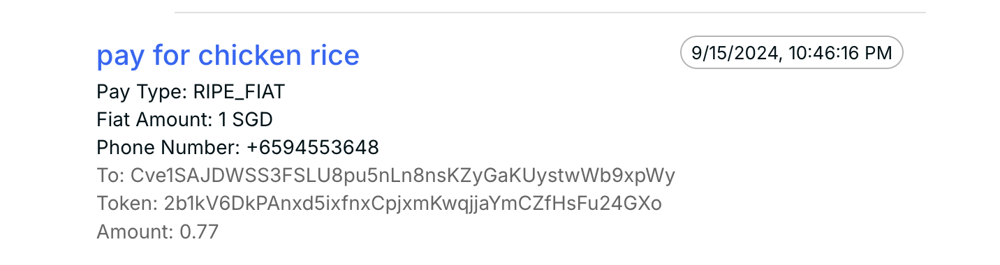

# Universal QR Scanner

This project is a npm package that provides React components and contexts for Solana chain QR payment services, that is built on top of Portal wallet and other service partners.

We provide a QR scanner for you to integrate into your wallet, that helps your wallet do payment and transfer:
- to Solana address
- via Solana Pay
- to fiat-accepting account

### UI Demo Project
[Demo Project](https://github.com/ripe-money/portal-hackathon-kit-web)

## Supports
Next.js

## Get Started

To Install:
```
npm i universal-qr-scanner
yarn add universal-qr-scanner
```

Include a next.config.mjs in your root
```
/** @type {import('next').NextConfig} */
const nextConfig = {
  env: {
    portalClientApiKey: process.env.PORTAL_CLIENT_API_KEY,
    solMint: 'So11111111111111111111111111111111111111112',
    solanaChainId: 'solana:5eykt4UsFv8P8NJdTREpY1vzqKqZKvdp',                   // Mainnet
    pyUsdMint: '2b1kV6DkPAnxd5ixfnxCpjxmKwqjjaYmCZfHsFu24GXo',                  // Mainnet
    solanaRpcUrl:
      'https://mainnet.helius-rpc.com/?api-key=' + process.env.HELIUS_API_KEY,  // Mainnet
    // solanaChainId: 'solana:EtWTRABZaYq6iMfeYKouRu166VU2xqa1',                // Dev net
    // pyUsdMint: 'CXk2AMBfi3TwaEL2468s6zP8xq9NxTXjp9gjMgzeUynM',               // Dev net
    // solanaRpcUrl: 'https://api.devnet.solana.com',                           // Dev net
  },
};

export default nextConfig;

```

Two keys are need in the .env
```
PORTAL_CLIENT_API_KEY=YOU_KEY_HERE
HELIUS_API_KEY=YOU_KEY_HERE
```

### Set up Route Handlers or API Routes in your project
[PORTAL's sample](https://github.com/portal-hq/portal-hackathon-kit-web/tree/main/pages/api)

Wrap ```PortalProvider``` and ```PayProvider``` around your project root.
```
import { PortalProvider, PayProvider } from 'universal-qr-scanner';

    <PortalProvider>
      <PayProvider>
        {children}
      </PayProvider>
    </PortalProvider>
```

On your page, import the PayUI Component, you are now all set to use payment functions in your wallet!
```
import { usePay, PayUI } from 'universal-qr-scanner';
import React from 'react';

const Scan = () => {
  const payCrypto = usePay();

  return <PayUI payCrypto={payCrypto} />;
};

export default Scan;
```


To view the payment transactions you made, use
```
  const payCrypto = usePay();
  const txns = await payCrypto.getPaymentTransactions();
```

## Build Your Own UI

Without using the PayUI component that we build, you can also build your own UI with the following core functions from ```usePay()```.
- reset()
  - resets to the initial state
- decode()
  - decode the raw QR data, identifies the embedded information and set the state accordingly
- updateFields()
  - update the states to get ready to initialize a payment, such as token amount, fiat amount and memo description
- pay()
  - sends the transaction with the encrypted memo field on chain
- getPaymentTransactions()
  - look on chain, identify, validate, decrypt and returns payment transactions made previously through Universal QR Scanner

## Payment Transaction Metadata

In order to differentiate a payment transaction made with our service, apart from the other on-chain activities, we designed a way to identify and validate those payment transactions.
For payment transactions made through Universal QR Scanner, they have a memo field attached, which contains:
- an identifier prefix for us to quickly locate it
- an encrypted information on the payment details such as payment type and fiat information (currency, amount)

For example: 


We use AES-256-CBC symmetric encryption with HMAC-SHA256 authentication. The data can be encrypted and decrypted using the same key, which in this case, the API key provided by [PORTAL](https://pyusd.portalhq.io/). The same key will used to decrypt the memo field data in ```payCrypto.getPaymentTransactions()```.
In this way, we can validate the authencity of the payment transaction and prevent any attempts at impersonating a transaction.

The actual data for the one above looks like this:
